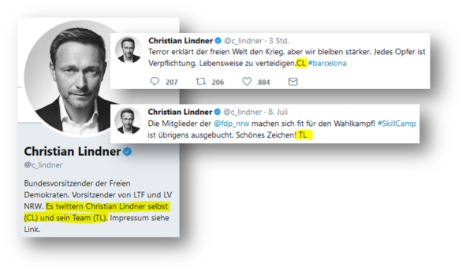

```{r setup, include=FALSE}
knitr::opts_chunk$set(echo = TRUE, # Whether R code chunks are displayed in the rendered document
                      eval = TRUE, # Whether R code chunks are executed
                      warning = FALSE, # Whether warnings are displayed
                      message = FALSE) # Whether messages are displayed
```

In this post, we try to examine tweets from the frontrunners of the most important German parties prior to this year's 
_Bundestagswahl_, the national elections.
To do so, we first use the R package `rtweet` to scrape tweets and then apply text mining functions from `tidytext` and `tm`.

By analyzing the short messages from the politicians, we aim to answer the following questions:

1. How **active** are the frontrunners on Twitter?
2. Does the **frequency of tweets** change as the Bundestagswahl comes closer?
3. How much **recognition and approval** do the candiates receive?
4. Are there **words that are characteristic for a politician**?
5. **Which politician is polarizing**, i.e., incorporates many _positive_ or _negative_ words?
6. **Which politicians are similar** with respect to their word usage? 

To reproduce the analysis, you can download the complete R code [here](https://github.com/unmnn/twitter_btw_mining).

Before we start, let's check which party frontruner actually does have a Twitter account.
The bad news first: the presumable winner of the elections, chancelor Angela Merkel, is not represented at the microblogging service.
However, her biggest challenger Martin Schulz from the SPD (Social Democratic Party of Germany) does tweet, 
as well as most of the other frontrunners of the most important German parties.

Here is an overview of the frontrunners of the 7 largest German parties and and their Twitter accounts:

- CDU (Christian Democratic Union): Angela Merkel _no Twitter account_
- CSU (Christian Social Union): Joachim Herrmann _no Twitter account_
- SPD (Social Democratic Party of Germany): Martin Schulz [&#64;MartinSchulz](https://twitter.com/MartinSchulz)
- Die Linke (The Left party): Sahra Wagenknecht [&#64;SWagenknecht](https://twitter.com/SWagenknecht) and Dietmar Bartsch [&#64;DietmarBartsch](https://twitter.com/DietmarBartsch)
- Grüne (Green party): Katrin Göring-Eckardt [&#64;GoeringEckardt](https://twitter.com/GoeringEckardt) and Cem Özdemir [&#64;cem_oezdemir](https://twitter.com/cem_oezdemir)
- FDP (Free Democratic Party): Christian Lindner [&#64;c_lindner](https://twitter.com/c_lindner)
- AfD (Alternative for Germany): Alice Weidel [&#64;Alice_Weidel](https://twitter.com/Alice_Weidel) and Alexander Gauland _no Twitter account_

We restrict our analysis on tweets from the current year.
Initially, I planned to conduct a long-term evaluation, starting with tweets from the beginning of the current legislation period in 2013.
However, the Twitter API allows to download just [the latest 3200 tweets](https://dev.twitter.com/rest/reference/get/statuses/user_timeline) (including retwets) of a user timeline.

First, we have to create a [Twitter app](https://apps.twitter.com/) to get credentials to access the api.
After we have generated the _key_ and _secret_ pair we are ready to use the `rtweet` package, which not only downloads the requested tweets, but automatically 
converts them into a convenient _tidy_ data frame format.

```{r load-libraries}
# Load all neccessary libraries
library(tidyverse)
library(lubridate)
library(stringr)
library(forcats)
library(rtweet)
# library(EBImage)
library(ggimage)
library(ggplot2bdc)
library(extrafont)
library(tidytext)
library(tm)
library(widyr)

# Set ggplot2bdc::theme_bdc_grey() as default ggplot2 theme for plotting later on
my_theme <- function(base_size = 13, base_family = "Arial Narrow") {
  theme_bdc_grey(base_size = base_size, base_family = base_family)
}
theme_set(my_theme())
```

```{r ggplot-custom-theme, include = FALSE}
# my_theme <- function(base_size = 11, base_family = "sans"){
#   theme_minimal(base_size = base_size, base_family = base_family) +
#   theme(
#     axis.text = element_text(size = 12),
#     axis.text.x = element_text(angle = 45, vjust = 0.5, hjust = 0.5),
#     axis.title = element_text(size = 14),
#     panel.grid.major = element_line(color = "grey"),
#     panel.grid.minor = element_blank(),
#     panel.background = element_rect(fill = "aliceblue"),
#     strip.background = element_rect(fill = "lightgrey", color = "grey", size = 1),
#     strip.text = element_text(face = "bold", size = 12, color = "black"),
#     legend.position = "bottom",
#     legend.justification = "top", 
#     legend.box = "horizontal",
#     legend.box.background = element_rect(colour = "grey50"),
#     legend.background = element_blank(),
#     panel.border = element_rect(color = "grey", fill = NA, size = 0.5)
#   )
# }
```


```{r twitter-setup, eval=FALSE}
# The procedure in this code chunk is based on the rtweet vignette, see
# https://github.com/mkearney/rtweet

# name assigned to created app
appname <- "BTW'17"
# API key (example below is not a real key)
key <- "36qjHG4JArZnmxtp2uBqE5wWg"
# API secret
secret <- "aL5NpbsR7euwk2RxdcCdJ4ak4q4CwNa5KGYfcfwt4hYEWsRZnT"
twitter_token <- create_token(
  app = appname,
  consumer_key = key,
  consumer_secret = secret)

# path of home directory
home_directory <- path.expand("~/")

# combine with name for token
file_name <- file.path(home_directory, "twitter_token.rds")

# save token to home directory
write_rds(twitter_token, file_name)

cat(paste0("TWITTER_PAT=", file_name),
    file = str_c(home_directory, ".Renviron"),
    append = TRUE)
```

The reading of user timelines may take some time. Therefore, we save the data frame containing the tweets 
as `.rds` file, which we can access offline at any time.

```{r accounts}
account_names <- c("MartinSchulz", 
                   "SWagenknecht", 
                   "DietmarBartsch", 
                   "GoeringEckardt", 
                   "cem_oezdemir", 
                   "c_lindner", 
                   "Alice_Weidel")
```


```{r read-tweets, eval = FALSE}
Sys.setlocale("LC_TIME", "English") # I had to change my locale to 'en' to avoid problems with the date/time format
tweets <- get_timeline(account_names, n = 3200, tweet_mode = "extended")
Sys.setlocale("LC_TIME", "German")
write_rds(tweets, str_c(getwd(), "/tweets.rds"))
```

```{r load-tweets}
tweets_2017 <- read_rds(str_c(getwd(), "/tweets.rds")) %>%
  select(screen_name, user_id, created_at, text, source, 
         is_retweet, favorite_count, retweet_count, lang) %>%
  filter(created_at > dmy("01.01.2017"))
glimpse(tweets_2017)
```


Next, we create a data frame, that assigns each account the corresponding party color and the profile picture.

```{r metadata}
twitter_info <- tibble(
  account_name = account_names,
  party_color = c("#E30013", "#DF007D", "#940252", "#1FAF12", "#0F7008", "#FFED00", "#009DE0"),
  party_logo = c("https://upload.wikimedia.org/wikipedia/commons/thumb/a/a4/SPD_logo.svg/200px-SPD_logo.svg.png",
                 rep("https://upload.wikimedia.org/wikipedia/commons/thumb/4/45/Die_Linke_logo.svg/200px-Die_Linke_logo.svg.png", 2),
                 rep("https://upload.wikimedia.org/wikipedia/commons/thumb/4/4b/B%C3%BCndnis_90_-_Die_Gr%C3%BCnen_Logo.svg/200px-B%C3%BCndnis_90_-_Die_Gr%C3%BCnen_Logo.svg.png", 2),
                 "https://upload.wikimedia.org/wikipedia/commons/thumb/e/e2/Logo_der_Freien_Demokraten.svg/200px-Logo_der_Freien_Demokraten.svg.png",
                 "https://upload.wikimedia.org/wikipedia/commons/thumb/b/b8/Alternative-fuer-Deutschland-Logo-2013.svg/200px-Alternative-fuer-Deutschland-Logo-2013.svg.png")
)

twitter_info %<>%
  bind_cols(tibble(account_image = lookup_users(twitter_info$account_name)$profile_image_url))%>%
  mutate(account_image = str_replace(account_image, "_normal\\.", "_200x200\\."))
```

Alright, now we take a look on the data and answer our first question.

## 1. How active are the frontrunners on Twitter?

```{r tweet-count, fig.width=7, fig.height=6}
# Count number of tweets and retweets per politician 
df_plot <- tweets_2017 %>%
  count(screen_name, is_retweet) %>%
  spread(is_retweet, n) %>%
  rename(own = `FALSE`, retweets = `TRUE`) %>%
  mutate(total = own + retweets) %>%
  inner_join(twitter_info, by = c("screen_name" = "account_name")) %>%
  mutate(screen_name = fct_rev(factor(screen_name, levels = twitter_info$account_name)))

ggplot(df_plot, aes(x = screen_name, fill = screen_name)) +
  geom_col(color = "grey", aes(y = total), alpha = .3) +
  geom_col(color = "grey", aes(y = own)) +
  geom_image(data = df_plot %>% group_by(screen_name) %>% slice(1) %>% ungroup(),
             aes(y = -150, image = account_image), size = .1) +
  scale_fill_manual(values = rev(twitter_info$party_color)) +
  coord_flip() +
  scale_y_continuous(limits = c(-200, max(df_plot$total))) +
  guides(fill = FALSE) +
  labs(x = NULL, y = "Number of tweets", title = str_c("Tweet count of German party frontrunners in 2017"),
       subtitle = str_c("retweets semi-transparent")) +
  theme(plot.caption = element_text(hjust = 0))
```

```{r lindnergoering, include=FALSE}
lindner <- tweets_2017 %>% 
  filter(screen_name == "c_lindner", is_retweet == FALSE) %>%
  summarize(n_fromteam = sum(str_detect(str_to_lower(text), "(tl($| #| http)|team lindner)")),
            n = n()
  )

goering <- tweets_2017 %>% 
  filter(screen_name == "GoeringEckardt", is_retweet == FALSE) %>%
  summarize(n_fromteam = sum(str_detect(str_to_lower(text), "/get")),
            n = n())
```

It seems as if Christian Lindner is the most diligent tweeter, followed by Katrin Göring-Eckardt and Cem Özdemir.
But wait a second: has the party leader of the FDP really sent over 900 tweets and retweeted more than 1000 times within  `r lubridate::yday(Sys.time())` days of 2017?
Looking at his profile page it becomes apparent that not all tweets are written by himself. 
Lindner closes his own short messages with his acronym _"CL"_ while tweets from his team are tagged with the abbreviation _"TL"_.
Besides Linder, Göring-Eckardts account is also supported by an editorial team.
Approximatly `r round(100*lindner$n_fromteam[1]/lindner$n[1])`% of Linder's tweets are written by his staff.
The respective number is ca. `r round(100*goering$n_fromteam[1]/goering$n[1])`% for Göring-Eckardt. 
We can assume that a considerable number of retweets are also not sent by the politicians themselves.  





Noticably, Martin Schulz and Shara Wagenknecht retweet relatively seldom in comparison with their rivals - an indication
that theses politicans have exlusive access to their twitter account?

Alice Weidel from the right-wing AfD has the least tweets so far, but she created her account only in February and her first tweet followed not until April.

## 2. Does the frequency of tweets change as the Bundestagswahl comes closer?

In the first 4 month of this year, particularly Christian Lindner and  Katrin Göring-Eckardt were the most active users.
Göring-Eckardt wasn't that active afterwards, whereas Lindner had a share of 50% in late April and mid-May.
But the amount of tweets is not equivalent to recognition and approval, which we see in the next section.

```{r tweet-history}
tweets_2017 %>%
  mutate(screen_name = factor(screen_name, twitter_info$account_name)) %>%
  filter(is_retweet == FALSE) %>%
  count(screen_name, week = round_date(created_at, "week")) %>%
  complete(screen_name, week, fill = list(n = 0)) %>%
  group_by(week) %>%
  mutate(percent = n / sum(n)) %>%
  mutate(maximum = cumsum(percent)) %>%
  mutate(minimum = lag(maximum, 1, 0)) %>%
  mutate(week_no = week(week)) %>%
  ggplot(aes(week, ymin = minimum, ymax = maximum, fill = screen_name)) +
  geom_ribbon(color = "grey") +
  scale_x_datetime(date_breaks = "2 weeks", date_labels = "%d. %b") +
  scale_fill_manual(values = twitter_info$party_color) +
  coord_cartesian(expand = 0) +
  scale_y_continuous(labels = scales::percent) +
  guides(fill = guide_legend(reverse = TRUE)) +
  labs(x = NULL, y = "Percentage of own tweets", 
       title =  "Proportion of tweets from the party frontrunners", fill = NULL) +
  theme(axis.text.x = element_text(angle = 45, hjust = 1))
```

## 3. How much recognition and approval do the candiates receive?

How much recognition and approval a candiate gets can be measured by number of retweets and favs.
Among the top 25 tweets with the most retweets, 18 come from Martin Schulz. 
With more than 5000 retweets his direct critic to Donald Trump on the United States' withdrawal from the Paris climate change agreement 
ranks first on the list of tweets with the most reweets.

```{r retweets, fig.height=7, fig.width=6}
tweets_2017$text2 <- iconv(tweets_2017$text, "UTF-8", "ASCII", sub="")

df_plot <- tweets_2017 %>%
  filter(is_retweet == FALSE) %>%
  arrange(desc(retweet_count)) %>%
  slice(1:25) %>%
  mutate(id = row_number()) %>%
  group_by(screen_name) %>%
  mutate(is_most_retweeted = row_number() == 1) %>%
  ungroup() %>%
  mutate(text2 = str_replace_all(text2,"[^[:graph:]]", " ")) %>%
  mutate(text2 = str_c("\"", text2, "\" (", format(created_at, "%d.%m."), ")")) %>%
  mutate(text2 = str_replace_all(text2, "(.{1,60})(\\s|$)", "\\1\n")) %>%
  mutate(screen_name = factor(screen_name, levels = twitter_info$account_name))

ggplot(df_plot, aes(x = id, y = retweet_count, fill = screen_name)) +
  geom_col(aes(color = is_most_retweeted, size = is_most_retweeted)) +
  coord_flip() + 
  scale_x_reverse(expand = c(.075,.075)) + 
  scale_y_continuous(limits = c(0, max(df_plot$retweet_count) + 5000), expand = c(0,0)) +
  scale_color_manual(values = c(NA, "black")) +
  scale_size_manual(values = c(0, .75)) +
  scale_fill_manual(values = twitter_info$party_color[twitter_info$account_name %in% 
                                                        unique(df_plot$screen_name)]) +
  geom_text(data = df_plot %>% filter(is_most_retweeted == TRUE),
            aes(label = text2), hjust = 0, size = 2.55, nudge_y = 300, vjust = .5) +
  guides(fill = guide_legend(""), color = FALSE, size = FALSE) +
  theme(axis.text.y = element_blank()) +
  theme(axis.ticks.y = element_blank()) +
  labs(x = NULL, y = "Number of retweets", title = "25 most retweeted tweets",
       caption = "Framed bar shows a candidate's most retweeted tweet")
```

Also with regard to number of favs, the SPD politician ranks first by a large margin, followed by Christian Lindner.
The portions are quite stable throughout the year, although Alice Weidel sorts herself on  third place after her 
registration in April and consequently reduces the shares of the other politicians. 

```{r favorites}
tweets_2017 %>%
  group_by(screen_name, month = floor_date(created_at, unit = "month")) %>%
  summarize(favorite_count = sum(favorite_count)) %>%
  ungroup() %>%
  group_by(month) %>%
  mutate(favoritePerc = favorite_count / sum(favorite_count)) %>%
  inner_join(twitter_info, by = c("screen_name" = "account_name")) %>%
  mutate(screen_name = factor(screen_name, levels = rev(twitter_info$account_name))) %>%
  ggplot(aes(x = month, y = favoritePerc, fill = screen_name)) +
  geom_area(color = "grey") +
  scale_x_datetime(expand = c(0,0)) +
  scale_y_continuous(labels = scales::percent, expand = c(0,0)) +
  scale_fill_manual(values = rev(twitter_info$party_color)) +
  labs(x = NULL, y = "Percentage of favs", fill = NULL,
       title = 'Proportion of Favs')
```

## 4. Are there words that are characteristic for a politician?

For this questions, we first perform a [word tokenisation](https://en.wikipedia.org/wiki/Lexical_analysis#Tokenization). 
Subsequently, we remove frequently used stop words like "and", "but" and "my".
Furthermore, we filter words with at least 3 letters and remove _mentions_ of other acounts, i.e. words that start with "@". 
For example, during the state election campaign in North Rhine-Westphalia, Martin Schulz frequently mentioned the 
account name of the state's former prime minister "@HanneloreKraft".

To extract a list of candiate-characteristic words, we calculate the [tf*idf](https://en.wikipedia.org/wiki/Tf%E2%80%93idf) 
score for each word with respect to the twitter account.
Words exibit a very high tf*idf score, if they are frequently used from a particular politican and seldom (or not at all) by the others.  

```{r top-words, fig.width = 5, fig.height=16}
unnest_reg <- "([^A-Za-zäöüÄÖÜß_\\d#@']|'(?![A-Za-zäöüÄÖÜß_\\d#@]))"

tidy_tweets <- tweets_2017 %>%
  filter(is_retweet == FALSE) %>%
  unnest_tokens(word, text, token = "regex", pattern = unnest_reg) %>% #, pattern = reg
  filter(!word %in% stopwords("german")) %>%
  filter(!word %in% stop_words$word)

tidy_tweets %>%
  count(screen_name, word) %>%
  ungroup() %>%
  bind_tf_idf(word, screen_name, n) %>%
  filter(nchar(word) > 2) %>%
  filter(str_detect(word, "^@") == FALSE) %>%
  arrange(screen_name, desc(tf_idf)) %>%
  group_by(screen_name) %>%
  slice(1:15) %>%
  ungroup() %>%
  mutate(screen_name = factor(screen_name, levels = twitter_info$account_name)) %>%
  mutate(word = factor(word, levels = rev(unique(word)))) %>%
  ggplot(aes(x = word, y = tf_idf, fill = screen_name)) +
  geom_col() +
  scale_fill_manual(values = twitter_info$party_color) +
  facet_wrap(~screen_name, scales = "free", ncol = 1) +
  coord_flip() +
  guides(fill = FALSE) +
  labs(x = NULL, y = "tf-idf")
```

The words "kämpft" (fights),  "schockiert" (shocked), "telefoniert" (phoned) and "investieren" (invest) are characteristic for Schulz.
He uses the word "angehörigen" (relatives) often in the the expression of his condolences with the dependants of victims, 
for example in context of the terror attacks in London, Manchester, Barcelona, Stockholm and Hamburg.
Furter, Schulz often attacks US president Donald Trump, either because of his reaction to the white supremacist rally in Charlottesville 
his plans to build a wall at the Mexican border, or, as mentioned above, the withdrawal of the USA from the Paris climate change agreement.
Noticably, Schulz rarely uses hashtags, in contrast to his rivals.

Sahra Wagenknecht uses her Twitter account clearly as platform to critizise the German government. 
She takes up issues like autobahn privatization, arms exports, military interventions, lobbyism and the German administration's way of 
dealing with the Turkish president Erdogan. 
Her "oppositional" tweets contain a lot of negatively connotated words, such as "Abzocke" (rip-off/fraud) and "Hintertür" (backdoor) 
which we examine shortly.

The green politicians Göring-Eckardt and Özdemir frequently address typically ecologic issues like environment, climate protection and e-mobility. 
Similar to Lindner and Weidel, both include  election campaign slogans in their tweets, for example "Zukunft wird aus Mut gemacht" (future is made of courage), 
"Gerechtigkeit im Sinn" (fairness in mind), "Es geht um unser Land" (it's about our country) and "Trau dich Deutschland" (Be courageous, Germany).

## 5. Which politician is polarizing, i.e., incorporates many _positive_ or _negative_ words?

To answer our fifth question, we leverage a [German sentiment dictionary](http://www.ulliwaltinger.de/sentiment/) to assign each word a polarity score, either +1 for positive, 0 for neutral or -1 for negative, and calculate the mean over all words 
written by a politician per month.

```{r polarity, fig.width=5, fig.height=4}
polarity <- c("http://www.ulliwaltinger.de/sentiment/GermanPolarityClues-2012/GermanPolarityClues-Negative-21042012.tsv.txt",
              "http://www.ulliwaltinger.de/sentiment/GermanPolarityClues-2012/GermanPolarityClues-Positive-21042012.tsv.txt") %>%
  map(function(x) {
    read_delim(x, delim = "\t", col_names = c("feature", "lemma", "pos", "polarity", "probability", "unknown")) %>%
      select("feature", "lemma", "polarity") %>%
      mutate(polarity_score = case_when(polarity == "negative" ~ -1,
                                        polarity == "positive" ~ 1,
                                        TRUE ~ 0)) %>%
      mutate(feature = tolower(feature)) %>%
      mutate(lemma = tolower(lemma))
  }) %>% bind_rows()

tidy_tweets %>%
  inner_join(polarity, by = c("word" = "feature")) %>%
  group_by(screen_name, month = floor_date(created_at, "month")) %>%
  summarize(average_sentiment = mean(polarity_score),#) %>%#,
            num_words = n()) %>%
  ungroup() %>%
  inner_join(twitter_info, by = c("screen_name" = "account_name")) %>%
  mutate(screen_name = factor(screen_name, levels = twitter_info$account_name)) %>%
  ggplot(aes(x = month, y = average_sentiment, color = screen_name)) +
  geom_line(linetype = 3) + geom_point() +
  geom_hline(yintercept = 0, color = "black") +
  scale_color_manual(values = twitter_info$party_color) +
  labs(x = NULL, color = NULL, y = "Average polarity",
       title = "Average polarity score")
```

Both candidates of The Left Party, Bartsch and in particular Wagenknecht, use explicitly more negative language than the 
others. 
Wagenknecht uses words like "endlich" (eventually), "müssen" (must), "beenden" (end/finish), "krieg" (war), "abzocke" (fraud/rip-off), "anti", "nein" (no), "peinlich" (embarrasing) oder "schlecht" (bad), Bartsch u.a. "armut" (poverty), 
"bedrohen" (threaten), "verletzt" (hurt) und "blödsinn" (nonsense).
While the high average polarity score of the right conservative AfD nominee Weidel in April stands out, it is also the month 
of her first tweets, and caused by using positive words like "dank" (thank), "freuen" (delight) and "gemeinsam" (together). 
From the second month on, her language became slightly more negative and was in the range of her opponents from 
SPD, Green Party and FDP.

## 6. Which politicians are similar with respect to their word usage? 

To be honest, the question of who will be the winner of the coming national election doesn't really arise.
Current polls predict a big margin for the union of CDU/CSU, led by chancellor Merkel, over their nearest challengers 
from Schulz' SPD. 
However, it is unlikely that Merkels party will obtain the absolute majority in the popular vote, so they will 
probably have to strike up a coalition with another party. 
So the more exciting question is not who will win but rather which group of parties will form a government coalition 
for the next legislation period?
Will it be another "Great coalition" (CDU/CSU + SPD), will we see a comeback of the FDP which missed the 5% threshold 
at the last national elections or will we see the first  three-way alliance in the history with "Jamaica" (CDU/CSU + 
Green + FDP) or "Rot-Rot-Grün" (SPD + Left + Green)?

Ideally, the parties with the highest intersection in their programs form a coalition with each other. 
Obviously, the parties' frontrunners have a big impact on the outcome of coalition negotiations. 
Based on the similarity of word usage in their tweets, are we capable of deriving pairs of parties that are most likely to form a coalition with each other? 

To assess similarity between politicians, we employ the [Pearson correlation coefficient](https://en.wikipedia.org/wiki/Pearson_correlation_coefficient): broadly, two politicians are similar 
if both use the 
same words similarly often or seldom and thus have a high correlation score. 
The score ranges between -1 (negative correlation) and +1 (positive correlation), with 0 being uncorrelated.

```{r correlation, fig.width=5, fig.height=4}
tidy_tweets %>%
  inner_join(polarity, by = c("word" = "feature")) %>%
  mutate(screen_name = factor(screen_name, levels = twitter_info$account_name)) %>%
  count(screen_name, lemma) %>%
  pairwise_cor(screen_name, lemma, n, diag = TRUE) %>%
  mutate(no_1 = as.integer(item1)) %>%
  mutate(no_2 = as.integer(item2)) %>%
  filter(no_1 <= no_2) %>% 
  ggplot(aes(item1, fct_rev(item2), fill = correlation)) +
  geom_tile() +
  geom_text(aes(label = round(correlation, 2))) +
  scale_x_discrete(expand = c(0,0)) +
  scale_y_discrete(expand = c(0,0)) +
  scale_fill_gradient(name = expression(phi * " coefficient"), low = "#FFFAEB", high = "steelblue") +
  theme(legend.position = c(.9,.9)) +
  theme(legend.justification = c(1,1)) +
  theme(axis.text.x = element_text(angle = 25, hjust = 1)) +
  labs(x = NULL, y = NULL, title = "Correlation between politicians based on word usage")
```

Noticably, the correlation matrix mirrors what we could have expected if we take the party memberships of the candiates into account. 
With a score of .86, the Green politicians Göring-Eckardt and Özdemir are most similar. 
Both are similar to Schulz and different to Weidel. 
The high score between Göring-Eckardt and Lindner is maybe surprising. 
Interestingly, the correlation coefficient between Bartsch and Wagenknecht is Bartsch's second lowest score. 
This is indicative that the party pursued a two-fold strategy, on the one hand addressing the moderate wing with the nomination of Bartsch and covering the left wing with the nomination of Wagenknecht. 
The matrix also shows that there is litte chance of a coalition between AfD an the Left Party. 

```{r}
tidy_tweets %>%
  inner_join(polarity, by = c("word" = "feature")) %>%
  count(screen_name, lemma) %>%
  pairwise_cor(screen_name, lemma, n, diag = TRUE) %>%
  group_by(item1) %>%
  summarize(sum_cor = sum(correlation)) %>%
  arrange(desc(sum_cor)) %>%
  rename(candidate = item1, sum_cor_coef = sum_cor)
```

Looking at the sum of pairwise correlation coefficients, we see tht politicans from the political center show higher values 
than the left and right candidates. 
Consequently, SPD, Green, and FDP have theoretically multiple coaltion options. 
I found it very interesting to connect Tweets from party representatives to  potential government coalition constellations...

```{r session-info}
sessionInfo()
```
