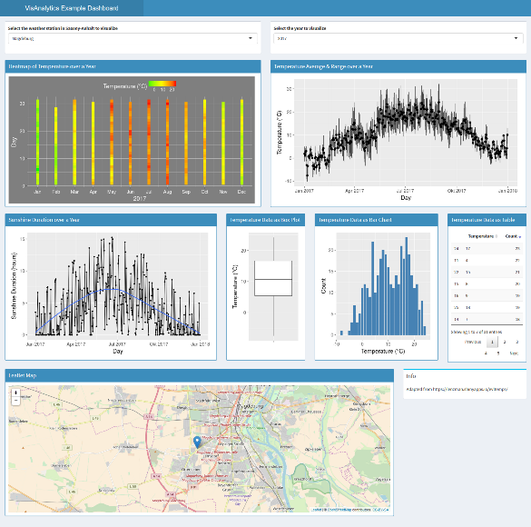

```{r setup, include=FALSE}
knitr::opts_chunk$set(echo = TRUE, # Whether R code chunks are displayed in the rendered document
                      eval = TRUE, # Whether R code chunks are executed
                      warning = FALSE, # Whether warnings are displayed
                      message = FALSE) # Whether messages are displayed
```

In this post, we will systematically and reproducibly download weather data from the [German Meteorologica Service (Deutscher Wetterdienst)](https://www.dwd.de/) website.  Our goal is to gather historical temperature recordings from all available weather stations of my home state Saxony-Anhalt. The data is used in [this R Shiny App](https://rbsenzaehler.shinyapps.io/Shiny_Temps_Saxony_Anhalt/) that serves as introductory demo for the course [Visual Analytics](http://www.vismd.de/doku.php?id=teaching:visanalytics) which I teach at the University of Magdeburg.  

We can access historical and recent weather data from the German Meterologica Service from their dedicated [ftp server](ftp://ftp-cdc.dwd.de/pub/CDC/).  
The files are organized in a folder structure where each weather station has its own zip folder containing the raw measurements.   

<!-- `r knitr::asis_output("\u2764")` -->


First, we load all required libraries. Then, we browse to the subfolder `observations_germany/climate/daily/kl/recent/` to examine a text file that contains meta information for each weather station, i. e., its ID, location, height, longitude & latitude, and the German state (Bundesland) where its located. Unfortunately, the file columns are rather awkwardly delimited (no csv style or similar) which means that we have to painfully parse each line by exact character positions.

```{r libraries_and_station_meta_data}
library(stringr)
library(dplyr)
library(readr)
library(tidyr)
library(purrr)
library(rvest)
library(lubridate)

url_station_description <- "ftp://ftp-cdc.dwd.de/pub/CDC/observations_germany/climate/daily/kl/recent/KL_Tageswerte_Beschreibung_Stationen.txt"
df_description <- tibble(full = readLines(url_station_description))

tidy_df_description <- df_description %>%
  slice(-c(1:2)) %>%
  mutate(station_id = str_sub(full, 1,5)) %>%
  mutate(von_datum = str_sub(full, 6,14)) %>%
  mutate(bis_datum = str_sub(full, 15, 23)) %>%
  mutate(stationshoehe = str_sub(full, 24, 39)) %>%
  mutate(geo_breite = str_sub(full, 40, 52)) %>%
  mutate(geo_laenge = str_sub(full, 53, 60)) %>%
  mutate(station_name = str_sub(full, 61, 102)) %>%
  mutate(bundesland = str_sub(full, 103, 130)) %>%
  select(-full) %>%
  map_dfc(str_trim) %>%
  mutate(station_id = as.integer(station_id)) %>%
  mutate(geo_breite = as.double(geo_breite)) %>%
  mutate(geo_laenge = as.double(geo_laenge))

# Filter stations located in my beloved home state ;-)
df_st <- tidy_df_description %>% filter(bundesland == "Sachsen-Anhalt")
df_st
```

We see that there are `r nrow(df_st)` regional weather stations. However, the `bis_datum` variable shows that some of them were discontinued. How many weather stations are still currently active?

```{r active_stations}
df_st %>% filter(str_sub(bis_datum, 1, 4) == as.character(year(now()))) %>% nrow()
```

Historical and recent temperature recordings are stored in separate folders. Therefore, we crawl each subfolder, compile a list of all hyperlinks pointing to the corresponding zip files of the stations' raw temperature measurements and extract the station ID which is part of the hyperlink. Remember that we are only interested in Saxony-Anhalt's weather stations, so we retain only those links that include the IDs of regional stations.  

```{r compile_list_of_hyperlinks}
url_files <- "ftp://ftp-cdc.dwd.de/pub/CDC/observations_germany/climate/daily/kl/"
files_dwd <- tibble(file = read_html(str_c(url_files, "historical/")) %>% 
                      html_text() %>%
                      str_extract_all("tageswerte_KL_\\d{5}_\\d{8}_\\d{8}_hist\\.zip") %>% 
                      unlist()) %>%
  bind_rows(
    tibble(file = read_html(str_c(url_files, "recent/")) %>% rvest::html_text() %>%
             str_extract_all("tageswerte_KL_\\d{5}_akt\\.zip") %>% unlist())
  ) %>%
  mutate(station_id = as.integer(str_sub(file, 15, 19))) %>%
  filter(station_id %in% df_st$station_id) %>%
  mutate(complete_url = str_c(url_files, ifelse(str_detect(file, "hist"),  "historical/", "recent/"), file))

head(files_dwd, 3) %>% as.data.frame()
```


Next, we will download the zip files. We create a temporary local folder and download all zip files.  We extract the archives into a separate folder, iteratively load the relevant files (only those containing the substring "produkt"), rowwise combine them, and finally delete the temporary folders and their contents.

```{r download_extract_load_save}
# Download files
if(!file.exists("zip_files")) {dir.create("zip_files/")}
walk(1:nrow(files_dwd), ~ download.file(files_dwd$complete_url[.x], destfile = str_c("zip_files/", files_dwd$file[.x])))

# Unzip all containers into a new directory.
if(!file.exists("zip_files_unzipped")) {dir.create("zip_files_unzipped/")}
list.files("zip_files", full.names = TRUE) %>% walk(~ unzip(.x, exdir = str_c(getwd(), "/zip_files_unzipped")))

# We read all ';'-separated files that contain the temperature data, rowwise combine them and 
# apply an inner join with the meta data from above
# to have also the name of the station and its geoposition available.
temperature_data_st <- list.files("zip_files_unzipped", full.names = TRUE, pattern = "^produkt") %>%
  map_dfr(~read_delim(.x, delim = ";", trim_ws = TRUE, na = "-999", col_types = c("iicddcdcddddddddddc"))) %>%
  inner_join(df_st %>% select(STATIONS_ID = station_id, geo_breite, geo_laenge, station_name), by = "STATIONS_ID")

# Remove temporary folders and files.
unlink("zip_files", recursive = TRUE)
unlink("zip_files_unzipped", recursive = TRUE)

# Select relevant variables
temperature_data_st <- temperature_data_st %>%
  select(STATIONS_ID, # station id
         station_name, # station name
         MESS_DATUM, # measuring date
         RSK, # daily precipitation depth
         SDK, # daily sunshine hours
         PM, # avg. air pressure
         TMK, # avg. temperature
         UPM, # avg. humidity
         TXK, # max. temperature at 2m
         TNK, # min. temperature at 2m
         TGK, # min. temperature at 5cm,
         geo_breite, # latitude of station position
         geo_laenge # longitude of station position
  ) 

temperature_data_st
```

```{r write_rds, include=FALSE, eval=FALSE}
# Save data frame in a convinient rds file 
temperature_data_st %>% write_rds("temperature_data_saxony_anhalt.rds")
```

As mentioned in the beginning, the data are visualized in this small [R Shiny app](https://rbsenzaehler.shinyapps.io/Shiny_Temps_Saxony_Anhalt/).  



```{r session-info}
sessionInfo()
```
